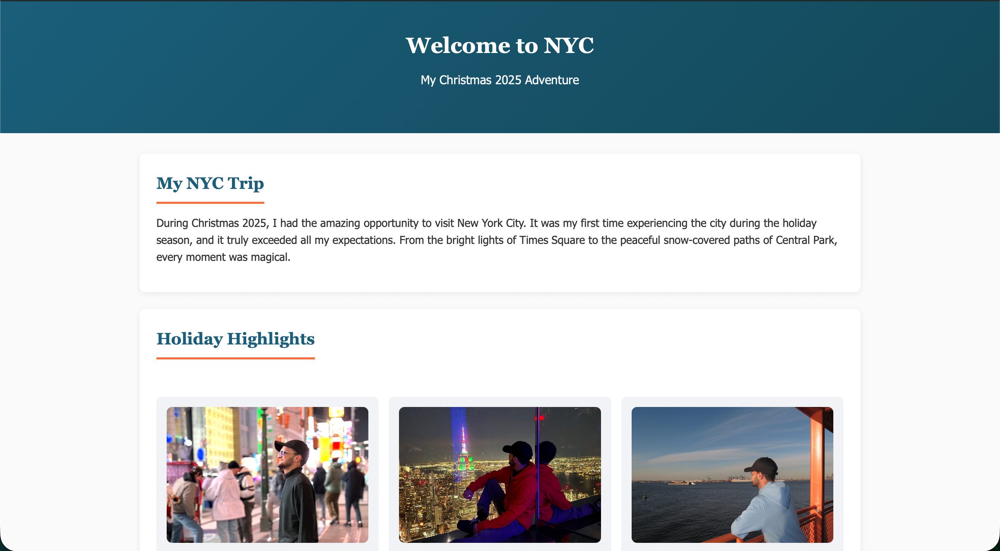

📍 NYC Christmas 2025 – Travel Website

A visually appealing personal travel website showcasing my unforgettable trip to New York City during Christmas 2025. This project highlights key experiences, memories, and moments through a clean and responsive design.

🌐 Live Preview

📸 Project Preview

Make sure to place your image inside an assets folder and rename it to nyc-preview.png (or update the path accordingly).

✨ Features

🎄 Beautiful Christmas-themed UI
🗽 NYC travel storytelling layout
🖼️ Image gallery with highlights
📱 Responsive design (works on mobile & desktop)
🎨 Clean and modern styling

🛠️ Technologies Used
HTML5
CSS3

📂 Project Structure
NYC-Trip-Website/
│
├── index.html
├── style.css
├── assets/
│   └── nyc-preview.png
└── README.md

🚀 How to Run Locally

Clone the repository:
git clone https://github.com/your-username/nyc-trip-website.git
Navigate into the folder:
cd nyc-trip-website
Open index.html in your browser.

🙌 Acknowledgment

This project was created to capture and share my personal travel experience in NYC during Christmas 2025.
